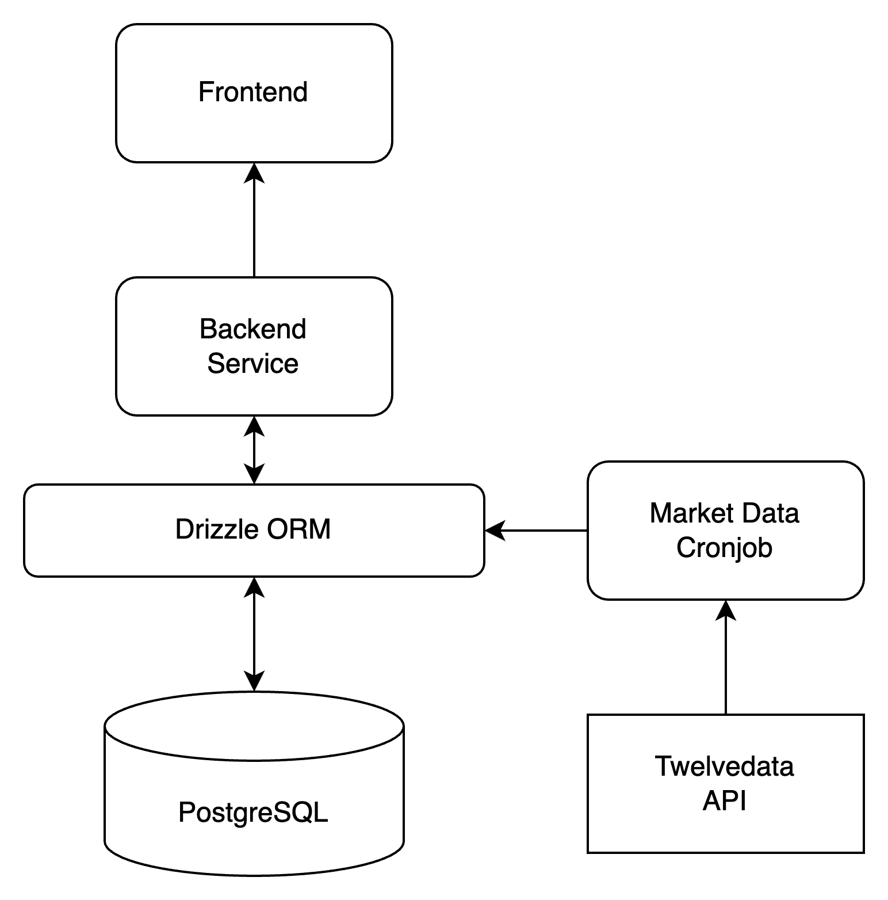
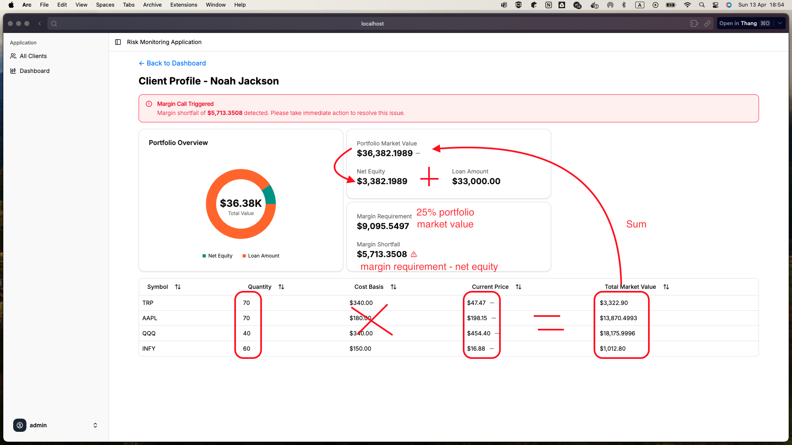
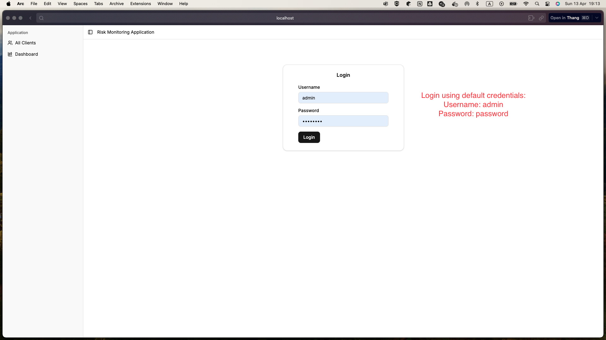
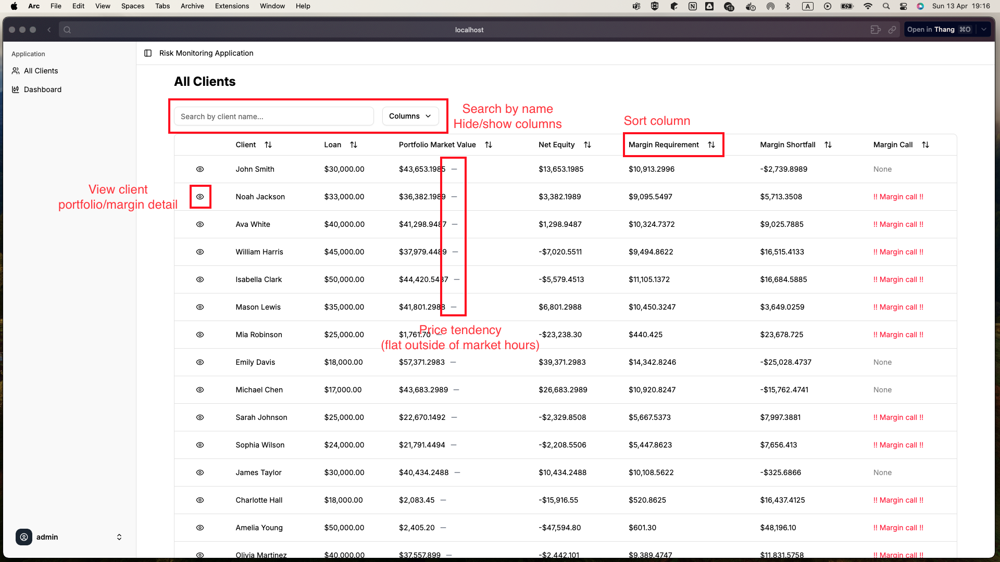
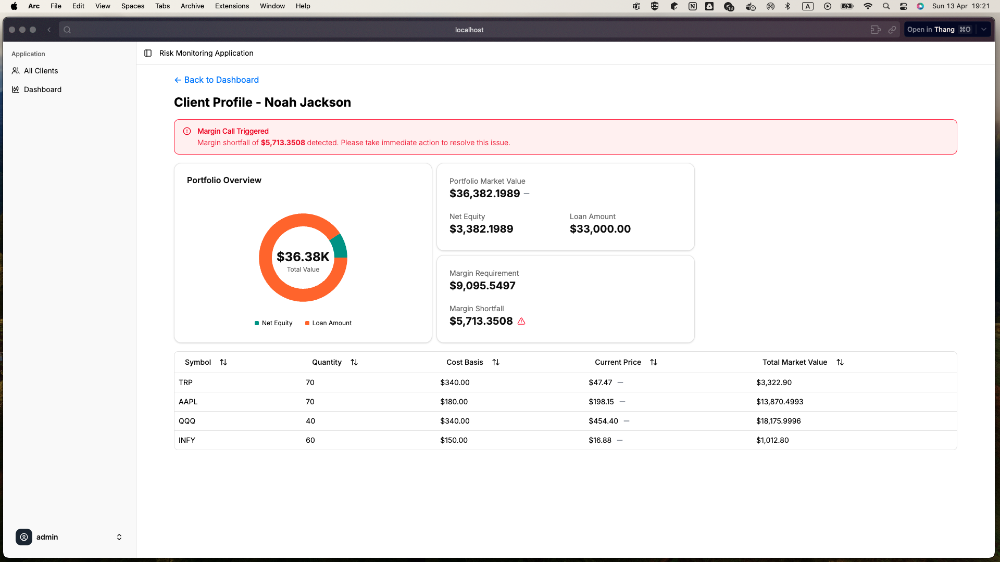
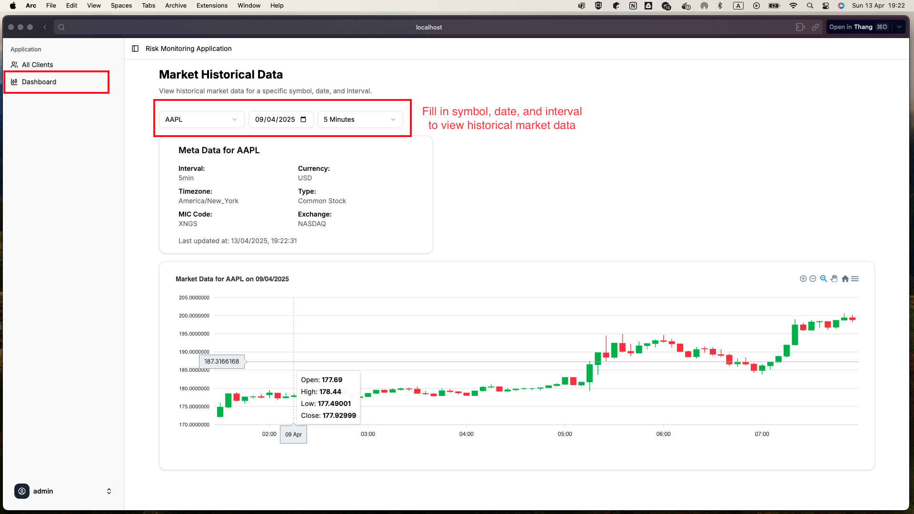

# Mini Risk Monitoring System

Default account credentials:

- Username: `admin`
- Password: `password`

## Architecture



The system consists of the following components:

1. **Frontend**: The user interface where users interact with the system.

   - Built with React, TypeScript, Tailwind CSS, Shadcn/ui, and Tanstack Query.
   - Features:
     - Basic login functionality
     - Data table with sorting, filtering for all clients
     - Client portfolio/margin detailed view
     - Visualization of market historical data

2. **Backend Service**: Handles business logic and communicates with the database and external APIs.

   - Built with Bun, Node.js, Express, and TypeScript.
   - Features:
     - RESTful API for the frontend to interact with
     - Authentication and authorization
     - Data processing and business logic

3. **Drizzle ORM**: An abstraction layer for interacting with the PostgreSQL database.
4. **PostgreSQL**: Persistent storage for client data, market data, and other relevant information.
5. **Market Data Cronjob**: Periodically fetches market data from the TwelveData API and updates the database.

## Setup and Installation

### Prerequisites

[Bun](https://bun.sh/), [Docker](https://www.docker.com/)

### Steps

Rename `.env.example` to `.env`.

#### Backend + Database + Cronjob

```sh
cd lighthouse-canton-backend
docker-compose up -d
```

This starts the backend at `http://localhost:8080`

#### Frontend

```sh
cd lighthouse-canton-frontend
bun install
bun dev
```

You can now access the frontend at `http://localhost:5173`.

## Tech Stack

### Frontend Stack

- **React**: Suitable for building interactive and responsive user interfaces with real-time data updates. SEO is not a priority for this project so we do not need meta frameworks like Next.js.
- **TypeScript**: Provides static typing, which helps catch errors early and improves code quality. It also enhances the development and collaboration experience.
- **Tailwind CSS**: A utility-first CSS framework that allows for rapid UI development. It provides a consistent design system and makes it easy to create responsive layouts.
- **Tanstack Query**: An asynchronous state management library for React. It simplifies data fetching, caching, and synchronization with the server. It also removes the need for useEffect and useState for data fetching, making the code cleaner and more maintainable.
- **Shadcn/ui**: A component library that provides pre-built UI components, speeding up development and ensuring a consistent design language. It's also transparent, allowing for easy customization and theming.

### Backend Stack

**Bun**: A modern JavaScript runtime that is faster than Node.js. It also supports TypeScript out of the box, which helps in building a type-safe backend.

**Express.js**: Minimal and flexible Node.js web application framework which is widely used for building APIs.

**Drizzle ORM**: A TypeScript ORM for PostgreSQL that provides a type-safe way to interact with the database, making it easier to write and maintain database queries. It supports migrations, which helps in managing database schema changes over time. It also provides a UI for managing the database (Drizzle Studio).

**PostgreSQL**: The problem involves a lot of relational data like clients, portfolios, and market data. PostgreSQL is a powerful relational database that supports complex queries and transactions.

## Backend API Endpoints

See [lighthouse-canton-backend/README.md](lighthouse-canton-backend/README.md) for the list of API endpoints.

## Testing



## Known Limitations

- The frontend is not fully responsive. It works well on desktop and tablet but may not be optimized for mobile devices.
- The backend does not have a robust authentication and authorization system. It uses a simple token-based authentication for demonstration purposes.
- No alert notifications for margin calls implemented.
- No create/update/delete functionality for clients and portfolios implemented.
- No data mocking for the market data implemented, so to test the real-time data fetching, you need to run the application during market hours.
- The number of symbols supported is limited due to application using the 'demo' API key from TwelveData.
- No pagination for the data table implemented. The table loads all data at once, which may cause performance issues with large datasets. However, for the demo, it is not a problem.

## Application Demo

Login Page:



Client List Page:



Client Detail Page:



Market Data Page:


